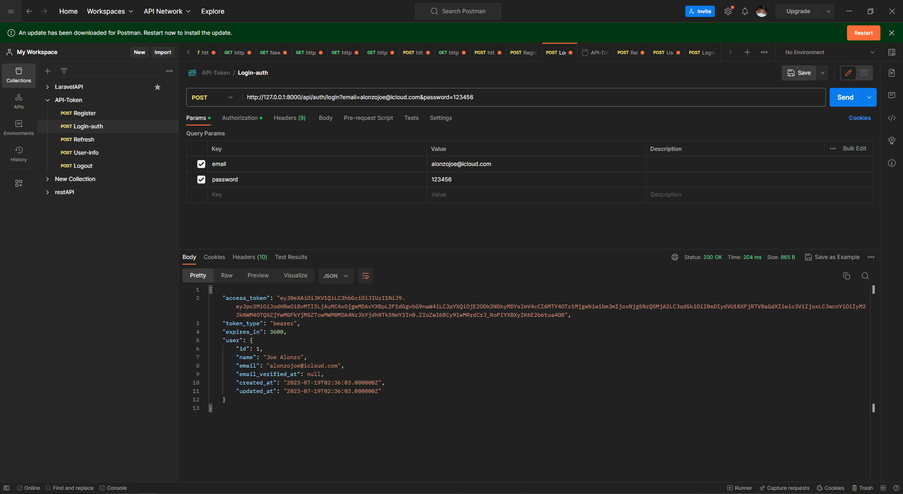

# Laravel 8 Auth JWT Token

This project demonstrates user registration, login, userinfo, token refreshing, and sign out using Laravel 8 and JWT (JSON Web Tokens).

## Features

- User registration: Allows users to create an account with their name, email, and password.
  
- User login: Provides an endpoint to authenticate users and generate JWT access tokens.
  
- User info: Retrieves user information based on the authenticated token.
  
- Token refreshing: Allows refreshing the access token using a refresh token.
  
- Sign out: Logs out the user and invalidates the token.



## Prerequisites

- PHP 7.4 or higher
- Laravel 8
- Composer

## Getting Started

1. Clone the repository:

   ```bash
   git clone https://github.com/alonzojoe/Larvel-8-Auth-JWT-Token.git

2. Install dependencies:

   composer install

3. Set up the environment:

	Set up the environment:

        -Copy the .env.example file and rename it to .env.
        -Update the necessary configuration options in the .env file, such as database credentials and JWT secret.

4. Generate an application key:

        php artisan jwt:secret

5. Run the migrations:

	php artisan migrate

6. Start the development server:

        php artisan serve


6. You're ready to go! Visit http://localhost:8000 in your browser to access the application.

API Endpoints 
-POST /api/register - Register a new user.
-POST /api/login - Authenticate user and generate access token.
-POST /api/user - Get authenticated user information.
-POST /api/refresh - Refresh the access token using the refresh token.
-POST /api/logout - Log out the user and invalidate the token.
Contributing
Contributions are welcome! If you find any issues or have suggestions for improvements, please feel free to submit a pull request or open an issue.


